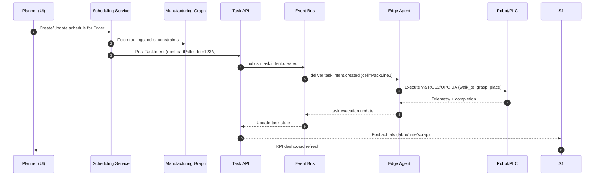

# Architecture (Post‑Migration)

## System Overview
```mermaid
flowchart TB
  subgraph Clients
    A1[Web Console (Planner/Scheduler/Buyer)]
    A2[Mobile Operator]
    A3[Integrator Portal]
  end

  subgraph ControlPlane[Cloud Control Plane]
    B1[API Gateway / BFF (GraphQL+REST)]
    B2[Auth (OIDC Provider)]
    B3[Observability (OTel→Prom/Grafana/Loki)]
    B4[Event Bus (Kafka/Redpanda)]
    B5[Object Store (S3-compatible)]
    B6[Analytics (DuckDB/Snowflake)]
  end

  subgraph Services[Core & Domain Services]
    S1[Orders/Inventory/BOM/Costing (Postgres)]
    S2[Scheduling & Planning]
    S3[Manufacturing Graph]
    S4[Quality & Traceability]
    S5[Maintenance]
    S6[Task API (REST+gRPC)]
    S7[AI Copilots (Planner/Buyer/Quality)]
  end

  subgraph Edge[Factory Edge (k3s)]
    E1[Edge Agent]
    E2[OPC UA Adapter]
    E3[MQTT Sparkplug B]
    E4[ROS 2 Bridge]
    E5[Open‑RMF Site Coordinator]
    E6[Safety Guard (limits/zones)]
  end

  subgraph Legacy[Current ERP]
    L1[Flask Monolith\nAPI v2 :5006]
    L2[Celery/Redis]
    L3[(Postgres)]
  end

  A1 -- GraphQL --> B1
  A2 -- REST --> B1
  A3 -- Admin --> B1
  B1 <-- OIDC --> B2

  B1 <-.ERP proxy.-> L1
  L1 --- L2
  L1 --- L3

  B1 <-.-> S1
  B1 <-.-> S2
  B1 <-.-> S3
  B1 <-.-> S4
  B1 <-.-> S5
  B1 <-.-> S6

  S1 <--> B4
  S2 <--> B4
  S3 <--> B4
  S4 <--> B4
  S6 <--> B4
  B4 <--> E1

  E1 <--> E2
  E1 <--> E3
  E1 <--> E4
  E1 <--> E5
  E1 <--> E6

  E2 <--> PLC[PLCs/Cells]
  E4 <--> Robots[Robots/Humanoids]
  E5 <--> AMRs[AMRs/Doors/Lifts]

  S4 --> B5
  B4 --> B6
```

## Order → Robot Execution (Key Flow)


## Service Notes
- **Task API:** vendor‑neutral verbs; safety‑gated; maps to ROS 2/OPC UA.
- **Manufacturing Graph:** cells, ops, changeovers, yields, energy; ties costs to actions.
- **Scheduler:** heuristics or Temporal workflows; publishes intents and updates.
- **Edge & Adapters:** site‑resilient execution, offline cache, OTA updates.
- **Gateway/BFF:** single entry; proxies legacy ERP while peeling into services.
