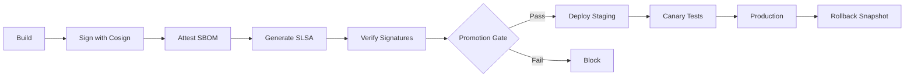

# CI/CD — Build, Scan, Release, GitOps

## Overview
Comprehensive CI/CD pipeline implementing secure build, test, sign, and deployment workflows for cloud services and edge components. Follows security-first principles with automated signing, SBOM generation, and staged rollouts.

## CI (GitHub Actions)

### Standard Build Pipeline
- **Lint** → Code quality checks (Ruff, ESLint, golangci-lint)
- **Unit tests** → Fast feedback on code changes
- **Contract tests** → API contract validation
- **Security scan** → Vulnerability detection (Trivy, Snyk)
- **Build images** → Multi-architecture container builds
- **SBOM** → Software Bill of Materials generation (CycloneDX)
- **Push registry** → Artifact storage (ghcr.io, ECR)

### OTA Signing Pipeline (ADR-007)

Implements secure OTA updates for edge components with cryptographic signing and attestation.

#### Components
- **Edge Agent** - Core edge runtime and update manager
- **OPC UA Adapter** - Industrial protocol bridge
- **ROS2 Bridge** - Robotics integration layer
- **MQTT Sparkplug** - IIoT messaging adapter

#### Workflow Stages



#### 1. Build & Push (Per Component)
```yaml
- Checkout code with full history
- Multi-platform build (linux/amd64, linux/arm64)
- Generate metadata tags (semver, sha, branch)
- Push to GitHub Container Registry
- Generate CycloneDX SBOM
```

#### 2. Signing (Keyless with OIDC)
```yaml
- Install Cosign v2.2.1
- Sign container image with GitHub OIDC
  * No private keys stored
  * Certificate bound to GitHub identity
  * Transparency log via Rekor
- Sign SBOM attestation
- Attach to image in registry
```

**Signing Command:**
```bash
cosign sign --yes \
  --oidc-issuer=https://token.actions.githubusercontent.com \
  ghcr.io/org/edge-agent@sha256:abc123...
```

#### 3. SLSA Provenance
- Generate SLSA Level 3 provenance
- Includes build parameters, dependencies, builder identity
- Immutably linked to artifact digest
- Verifiable supply chain metadata

#### 4. Manifest Generation
```bash
scripts/generate-ota-manifest.sh \
  --digests-file component-digests.txt \
  --version v1.2.3 \
  --commit abc123 \
  --rollback-ref v1.2.2 \
  --output ota-manifest.json
```

**Manifest Structure:**
```json
{
  "manifest_version": "1.0",
  "policy_version": "1.0.0",
  "version": "v1.2.3",
  "commit": "abc123",
  "timestamp": "2025-11-01T12:00:00Z",
  "components": [
    {
      "name": "edge-agent",
      "digest": "sha256:abc...",
      "type": "container",
      "updated_at": "2025-11-01T12:00:00Z"
    }
  ],
  "rollback_reference": "v1.2.2",
  "safety": {
    "requires_plc_approval": true,
    "max_rollout_percentage": 10,
    "health_check_timeout_seconds": 300,
    "auto_rollback_on_failure": true
  },
  "metadata": {
    "builder": "github-actions",
    "signing_method": "cosign-keyless-oidc",
    "manifest_checksum": "sha256:def..."
  }
}
```

#### 5. Promotion Gate (Security Checkpoint)

**Blocks deployment unless:**
- All component signatures verify
- Certificate identity matches GitHub repository
- SBOM attestations present
- Manifest signature valid
- Policy compliance checks pass

**Verification Steps:**
```bash
# Verify each component signature
cosign verify \
  --certificate-identity-regexp="https://github.com/org/repo" \
  --certificate-oidc-issuer=https://token.actions.githubusercontent.com \
  ghcr.io/org/edge-agent@sha256:abc...

# Verify SBOM attestation
cosign verify-attestation \
  --type cyclonedx \
  --certificate-identity-regexp="https://github.com/org/repo" \
  ghcr.io/org/edge-agent@sha256:abc...

# Verify manifest signature
cosign verify-blob \
  --certificate ota-manifest.crt \
  --signature ota-manifest.sig \
  ota-manifest.json
```

#### 6. Staged Rollout

**Staging Environment:**
- Deploy to canary node (standby cell)
- Run health checks (300s timeout)
- Validate metrics and logs
- Manual approval gate

**Production Environment:**
- Phase 1: Canary cell deployment
- Wait for validation (60s+)
- Phase 2: Production cells (max 10% rollout)
- Create rollback snapshot
- Monitor health metrics

#### 7. Rollback Mechanism

**Automatic Rollback Triggers:**
- Health check failures
- Crash loop detection
- PLC safety system alerts
- Manual operator intervention

**Rollback Process:**
```bash
# Edge Agent applies previous signed manifest
edge-agent ota rollback --manifest rollback-latest.json
```

### Security Features

#### Keyless Signing Benefits
- **No secret management** - Uses GitHub OIDC tokens
- **Ephemeral certificates** - Bound to workflow identity
- **Transparency** - All signatures logged in Rekor
- **Non-repudiation** - Cryptographically proves origin

#### Supply Chain Security (SLSA)
- **Level 3 compliance** - Build provenance generated
- **Hermetic builds** - Reproducible artifacts
- **Verifiable metadata** - Signed provenance attestations

#### Offline Edge Support
- Pre-verified bundles with cached trust roots
- Local signature verification
- Rollback without connectivity
- Trust bundle updates via secure channel

## Release

### Versioning
- **SemVer tags** (v1.2.3) trigger production deployments
- **Changelogs** auto-generated from conventional commits
- **Provenance attestations** attached to releases
- **Release notes** include security advisories

### Database Migrations
- **Blue/green deployments** for breaking schema changes
- **Flyway/Liquibase** for version-controlled migrations
- **Rollback scripts** tested before production
- **Zero-downtime** migration strategy

## GitOps (ArgoCD)

### Structure
- **App-of-Apps pattern** - Hierarchical application management
- **Environments:** `dev`, `staging`, `prod`
- **Edge OTA releases** triggered from `prod` after soak period (24-48h)

### Sync Policy
```yaml
apiVersion: argoproj.io/v1alpha1
kind: Application
metadata:
  name: edge-components
spec:
  syncPolicy:
    automated:
      prune: true
      selfHeal: true
    syncOptions:
      - CreateNamespace=true
```

### Edge Deployment Flow
1. Tag release in Git (v1.2.3)
2. OTA pipeline builds and signs
3. Promotion gate validates signatures
4. Deploy to staging canary
5. Soak period (24-48h)
6. ArgoCD syncs to production edge clusters
7. Edge Agent pulls signed manifest
8. Local verification before apply
9. Health checks and monitoring

## Infrastructure

### Infrastructure as Code
- **Terraform** for cloud resources
  * VPC, subnets, security groups
  * EKS/AKS/GKE clusters
  * RDS/CloudSQL databases
  * Secrets Manager/Vault integration
  * S3/GCS buckets for artifacts

### Kubernetes Resources
- **Helm charts** per service
- **NetworkPolicies** default-deny
- **PodSecurityPolicies** enforced
- **ResourceQuotas** per namespace
- **LimitRanges** for resource management

### Security Hardening
- **Image scanning** in CI pipeline
- **Runtime security** (Falco, Sysdig)
- **Secret rotation** automated
- **TLS everywhere** (cert-manager)
- **RBAC** least-privilege model

## Monitoring & Observability

### Build Metrics
- Build duration and success rate
- Signing operation latency
- Artifact size trends
- Test coverage percentage

### Deployment Metrics
- Deployment frequency
- Lead time for changes
- Change failure rate
- Mean time to recovery (MTTR)

### Edge OTA Metrics
- Update success rate per component
- Rollback frequency
- Signature verification failures
- Health check outcomes

## References

### Architecture Decision Records
- **ADR-007**: Edge OTA & Signing Policy
- **ADR-004**: Safety System Integration
- **ADR-005**: Observability Strategy

### Runbooks
- `RUNBOOK.md#ota-failure` - OTA update troubleshooting
- `RUNBOOK.md#rollback` - Manual rollback procedures
- `RUNBOOK.md#signature-verification` - Debugging signature issues

### Tools & Versions
- **Cosign**: v2.2.1 (Sigstore keyless signing)
- **SLSA Verifier**: v2.4.1
- **Trivy**: Latest (vulnerability scanning)
- **ArgoCD**: v2.8+ (GitOps deployment)
- **Terraform**: v1.5+ (infrastructure provisioning)

### Workflow Files
- `.github/workflows/ota-sign.yml` - OTA signing pipeline
- `.github/workflows/observability-check.yml` - Observability validation
- `scripts/generate-ota-manifest.sh` - Manifest generator

## Troubleshooting

### Signature Verification Failures

**Symptom:** Promotion gate blocks deployment
```
ERROR: Signature verification failed for edge-agent
```

**Resolution:**
1. Check certificate identity matches repository
2. Verify OIDC issuer is correct
3. Ensure image digest hasn't been modified
4. Check Rekor transparency log for entry

### Missing SBOM Attestations

**Symptom:** Attestation verification fails
```
ERROR: SBOM attestation missing for component
```

**Resolution:**
1. Verify build job completed successfully
2. Check Docker buildx provenance enabled
3. Ensure cosign attest step executed
4. Rebuild and re-sign component

### Rollback Issues

**Symptom:** Edge agent fails to apply rollback
```
ERROR: Rollback manifest signature invalid
```

**Resolution:**
1. Verify rollback manifest exists locally
2. Check signature file is present
3. Validate trust bundle is current
4. Manual intervention may be required

## Best Practices

### Security
1. **Never bypass promotion gate** - All production artifacts must be signed
2. **Rotate secrets regularly** - Use Vault/Secrets Manager automation
3. **Monitor transparency logs** - Alert on unexpected signing operations
4. **Test rollbacks regularly** - Include in disaster recovery drills

### Operations
1. **Gradual rollouts** - Use canary deployments for risk reduction
2. **Health checks mandatory** - Define clear success criteria
3. **Soak periods** - Allow time for issues to surface
4. **Automated rollback** - Don't rely on manual intervention

### Development
1. **Conventional commits** - Enable automated changelog generation
2. **Semantic versioning** - Clear compatibility signaling
3. **Test coverage** - Maintain >80% for core components
4. **Documentation** - Update ADRs and runbooks with changes
